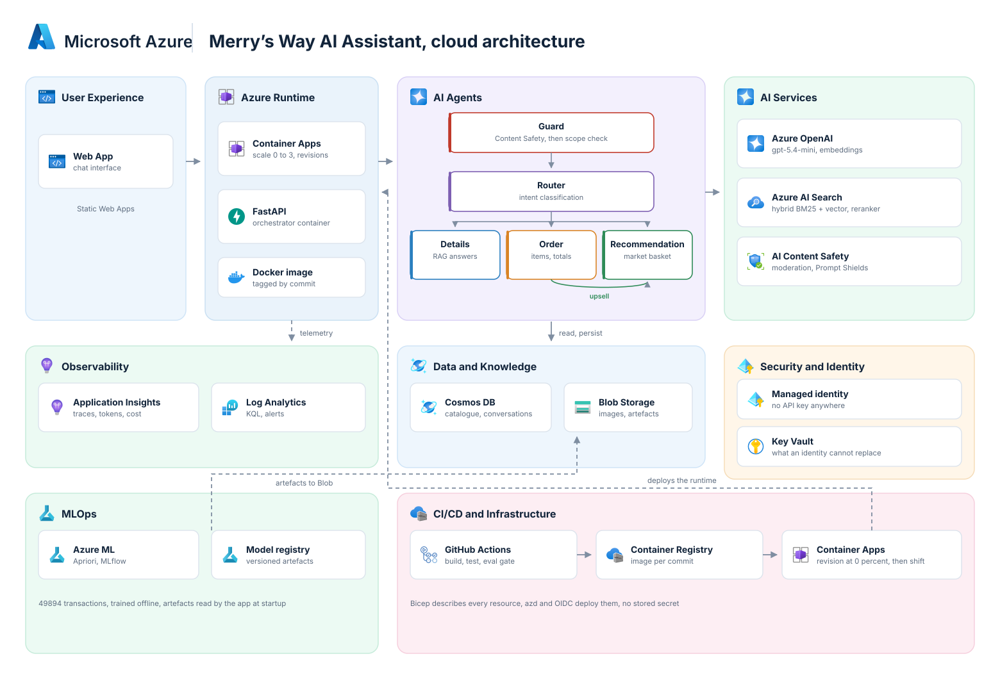
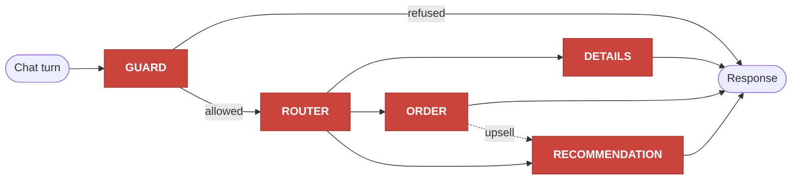

# Merry's Way: multi-agent coffee shop assistant on Azure

A conversational assistant for a coffee shop. It answers questions about the menu, takes orders and recommends products, through five specialised LLM agents running on Azure.

The assistant knows the shop: it reads the product catalogue, the opening hours and the delivery
areas, and it never invents a price. Orders are priced in Python from the catalogue, never by the
model, because a language model that does arithmetic on money will eventually get it wrong in
silence.

This repository is the Azure rebuild of a prototype that ran on OpenAI, Pinecone and Firebase. It
covers the full lifecycle: design, infrastructure as code, evaluation, deployment, monitoring and
CI/CD.

## What it does

| Feature | Detail |
|---|---|
| **Answer product questions** | Retrieval augmented generation over the catalogue and the shop knowledge base, with citations. Allergens and ingredients come from the catalogue, never from the model's memory. |
| **Take an order** | The model extracts items and quantities, Python resolves them against the catalogue and computes the total with `Decimal`. Off-menu items are called out explicitly. |
| **Recommend products** | Market basket analysis (Apriori) trained on 49894 real transactions, plus popularity overall and by category. Every recommendation is checked against the catalogue before it is shown. |
| **Upsell during an order** | Once the basket holds an item, the order agent hands over to the recommendation agent, once per conversation. |
| **Refuse what is out of scope** | Two layers: Azure AI Content Safety with Prompt Shields for moderation and prompt injection, then an LLM scope check for anything unrelated to the shop. |
| **Explain itself** | Every turn is traced and stored, so a conversation can be replayed end to end from its identifier. |

## Architecture



## The five agents

A turn goes through the guard, then the router, then exactly one specialised agent.



| Agent | Role | What it returns | Model setting |
|---|---|---|---|
| **Guard** | Is this message safe, and is it about the coffee shop? Content Safety runs first, then a scope check. | `allowed` or `not allowed`, with a reason that is traced | `reasoning_effort: minimal`, latency matters on every turn |
| **Router** | Which agent should answer? | one of `details`, `order`, `recommendation` | `reasoning_effort: minimal` |
| **Details** | Answers questions about products, hours, delivery and allergens | an answer plus the identifiers of the documents it used, or an explicit "I do not know" when nothing relevant is retrieved | `temperature: 0`, for reproducible wording between evaluation runs |
| **Order** | Builds the basket across turns | `[{product_id, quantity}]` only. Prices and totals are computed in Python | `reasoning_effort: minimal` |
| **Recommendation** | Suggests items, from the basket or from a requested category | three to five products, all filtered against the catalogue | `temperature: 0` |

Two design rules hold the whole thing together:

- **The model never produces a number that ends up on a bill.** It extracts intent, Python owns the money.
- **The catalogue is the single source of truth.** The menu injected into the prompts is rendered at
  runtime from the database, so a price exists in exactly one place.

The reasoning and the rejected alternatives are recorded as architecture decision records in
`docs/adr/`, published with the final documentation pass.

## Azure services, and why each one is there

| Service | Role in this project | Why this one |
|---|---|---|
| **Azure Container Apps** | Runs the FastAPI orchestrator as a container | Scales to zero when idle, and its revisions give blue and green deployments with no extra infrastructure |
| **Azure OpenAI** (`gpt-5.4-mini`, `text-embedding-3-small`) | Every agent call, and the embeddings for the index | Data Zone Standard keeps processing inside the EU, and Entra ID replaces API keys |
| **Azure AI Content Safety** | Moderation and Prompt Shields before any model call | A deterministic safety layer ahead of the LLM guard, which is bypassable on its own |
| **Azure AI Search** | Hybrid retrieval, BM25 plus vector with RRF fusion, then a semantic reranker | Lexical queries such as an exact product name defeat pure vector search. The gain is measured, not assumed |
| **Azure Cosmos DB** | Product catalogue and conversation history | Serverless, near free at this volume, with a 90 day time to live that expires conversations without a cleanup job |
| **Azure Blob Storage** | Product images and recommender model artefacts | Cheap object storage, read by the app with its managed identity |
| **Azure Machine Learning** | Trains and versions the recommender with MLflow | Data, code, metrics and model registered together, which is what makes the recommender reproducible |
| **Application Insights and Log Analytics** | Traces, token counts, cost and latency per conversation | One identifier gives the full trace of a failed conversation |
| **Azure Key Vault** | The few secrets that cannot be replaced by an identity | RBAC authorisation, no access policies |
| **Container Registry** | The API image, tagged by commit | Pulled with the managed identity, no admin password |
| **Managed identity and Entra ID** | The single principal that holds every permission | No API key exists anywhere in the system, which is verifiable rather than claimed |

## Getting started

### Prerequisites

Azure CLI 2.60 or later, `azd`, Docker, Python 3.11, and an Azure subscription.

### Local setup

```bash
make install          # Python 3.11 virtualenv with uv, dependencies, pre-commit hooks
make check            # lint, type check and unit tests, exactly what CI runs
```

### Deploy the infrastructure

```bash
az login
az group create -n rg-coffeeai-dev -l francecentral

make infra-preview    # what-if: shows what would change, changes nothing
make infra-up         # deploys, prints the endpoints it created
```

One template creates every resource listed above, along with the role assignments. Nothing is
created by hand, so `az group delete -n rg-coffeeai-dev` is a complete teardown and `make infra-up`
rebuilds it.

### Check that keyless authentication works

```bash
export AZURE_OPENAI_ENDPOINT=$(az cognitiveservices account show \
  -g rg-coffeeai-dev -n aif-coffeeai-dev-frc --query properties.endpoint -o tsv)

python scripts/smoke_ai.py
```

The script obtains an Entra ID token through `DefaultAzureCredential` and calls the model with it.
The same code runs unchanged in Azure, where the token comes from the managed identity instead of
your `az login` session. There is no key to configure, and none exists: `az cognitiveservices
account keys list` fails with `disableLocalAuth is set to be true`.

### Cost control

Azure AI Search is the only resource billed by the hour, at about 0.09 EUR per hour:

```bash
make search-up        # at the start of a working session
make search-down      # at the end, the index is rebuilt by `make index`
```

Everything else is billed per use: Container Apps scales to zero, Cosmos DB is serverless, and the
models are billed per token.

## Repository layout

```
├─ infra/                Bicep: main.bicep, modules/, shared/roles.bicep
├─ scripts/              operational scripts, starting with the keyless smoke test
├─ src/
│  ├─ api/               FastAPI: app/ agents/ core/
│  ├─ data_pipelines/    catalogue ingestion, search index build
│  ├─ ml/                Azure ML pipeline for the recommender
│  └─ web/               web front end
├─ evals/                golden datasets, evaluators, CI thresholds
├─ tests/                unit, integration, smoke
├─ data/raw/             catalogue, images, knowledge base, sales data
├─ legacy/               the original prototype, kept read only as a reference
└─ docs/                 requirements, architecture, ADRs, work journal
```

## Engineering practices

- **No secret anywhere.** Managed identity and Entra ID everywhere, account keys disabled on the
  storage account, the registry, Cosmos DB, AI Search and Azure OpenAI. `gitleaks` runs as a
  pre-commit hook and GitHub Push Protection is enabled.
- **Everything is code.** Every Azure resource comes from Bicep, with a `what-if` preview before any
  change, and role assignments declared next to the resource they protect.
- **Decisions are written down.** Seven ADRs record what was chosen, what was rejected and what it
  costs, including the ones that turned out to be wrong and were corrected by measurement.
- **Quality is measured, not claimed.** A golden dataset and threshold based evaluation gate block a
  pull request that degrades routing accuracy, retrieval recall or order correctness.
- **Everything is observable.** OpenTelemetry traces, token and cost metrics per conversation, and
  an alert when an order total ever mismatches.

## Status

| Phase | State |
|---|---|
| Design, ADRs, infrastructure as code | done, 11 resources deployed from source |
| Data pipelines and hybrid retrieval | in progress |
| Agents, API and safety | planned |
| Recommender on Azure ML | planned |
| Evaluation harness and CI gate | planned |
| Deployment, CI/CD and rollback | planned |
| Monitoring, dashboard and cost analysis | planned |

## Credits

Original prototype: *Coffee Shop Customer Service Chatbot* tutorial.
Sales dataset: [Kaggle, Coffee Shop Sample Data](https://www.kaggle.com/datasets/ylchang/coffee-shop-sample-data-1113).
