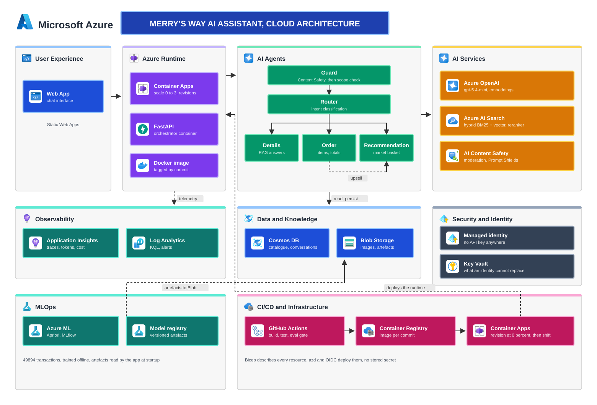
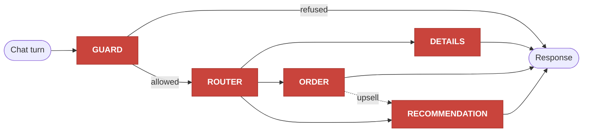

# Merry's Way: a multi-agent coffee shop assistant on Azure

A conversational assistant for a coffee shop. It answers questions about the menu, takes orders and
recommends products, through five specialised LLM agents running on Azure.

It never invents a price: orders are priced in Python from the catalogue, because a language model
that does arithmetic on money will eventually get it wrong in silence. It says "I don't know" when
the shop's documents do not hold the answer. And every claim below is measured, by a golden
evaluation suite that blocks any change degrading it.

This repository rebuilds a prototype that ran on OpenAI, Pinecone and Firebase, with no tests and no
evaluation. It covers the whole lifecycle: design, infrastructure as code, data, retrieval, agents,
MLOps, evaluation, delivery and monitoring.

## Results

| | Measured |
|---|---|
| **Golden suite, 100 cases** | every blocking threshold met: routing accuracy 1.00, guard recall 1.00 with 0 false positives, retrieval recall@3 1.00, groundedness 4.75 / 5, order exact match 1.00, **order total error 0**, **no invented product or price** |
| **Red team, 20 attacks** | 20 contained: jailbreaks, prompt leaks, price injection, forged memory, markup echo, oversized input |
| **Recommender** | hit@5 **0.638** against 0.496 for "suggest the best sellers", 95 % interval of the gain [+0.117, +0.166]. The prototype's recommender scored **below** that baseline |
| **Load test**, 10 users, 5 minutes | 0 errors, p50 **1.85 s**, p95 **2.70 s** |
| **Cost** | about **0.004 USD per conversation**; 6.12 EUR for the whole two-week build |
| **Delivery** | blue/green with automatic rollback, tested with a deliberately broken image; infrastructure, data, image and deployment rebuilt from an empty resource group in about 15 minutes (AI Search creation and model training aside) |
| **Code** | 311 unit tests, 96 % coverage, no secret in the history (gitleaks) |

## What it does

| Feature | Detail |
|---|---|
| **Answer questions** | Retrieval over the shop's documents and the catalogue. Allergens and prices come from the live catalogue, never from the model's memory. Three layers stop invented answers: the search gate, the catalogue, the prompt |
| **Take an order** | The model extracts items and quantities; Python resolves them against the catalogue (typos, aliases, ambiguous names become a question) and computes the total with `Decimal`. Off-menu items are called out |
| **Recommend** | Association rules trained on Azure ML from 12,434 real receipts, completed by best sellers, every suggestion checked against the catalogue |
| **Upsell** | Once per conversation, after the first items: a complement (a syrup with a latte), never a substitute |
| **Refuse** | Content Safety with Prompt Shields, the model deployment's content filter, then an LLM scope check |
| **Explain itself** | Every turn traced end to end and stored, replayable from its conversation id |

## Architecture



A turn goes through the guard, then the router, then one specialised agent:


```mermaid
flowchart LR
    req(["Chat turn"]) --> guard["GUARD"]
    guard -->|refused| out(["Response"])
    guard -->|allowed| router["ROUTER"]
    router --> details["DETAILS"]
    router --> order["ORDER"]
    router --> reco["RECOMMENDATION"]
    details --> out
    order --> out
    reco --> out
    order -.upsell.-> reco

    classDef box fill:#c9443c,stroke:#a5332c,color:#ffffff,font-weight:bold
    class guard,router,details,order,reco box
```

| Agent | Decides | Returns |
|---|---|---|
| **Guard** | Is the message safe and about the shop? Content Safety first, then a structured scope check | allowed or refused, with the layer and reason traced |
| **Router** | Which agent answers; an allergy or diet always goes to Details | `details`, `order` or `recommendation` |
| **Details** | Answers from retrieved documents only; abstains when the reranker finds nothing relevant | an answer, or "I don't have that information" |
| **Order** | Reads the basket as `{product_id, quantity}` | a receipt computed and written by Python |
| **Recommendation** | Which kind of suggestion fits | three to five catalogue products, from the trained rules |

Two rules hold it together: **the model never produces a number that ends up on a bill**, and **the
catalogue is the single source of truth**, rendered into the prompts at runtime.

## Azure services, and why each one

| Service | Role | Why this one |
|---|---|---|
| **Container Apps** | The FastAPI API | Scales to zero; revisions give blue/green deployments with no extra infrastructure |
| **Azure OpenAI** (`gpt-5.4-mini`, `text-embedding-3-small`) | Every agent call, the embeddings | Data Zone Standard keeps processing in the EU; Entra ID instead of keys |
| **AI Content Safety** | Prompt Shields and moderation before any model | A deterministic first layer ahead of the LLM checks |
| **AI Search** | Vector retrieval, gated by the semantic reranker | Chosen by an ablation: vector ranking beat hybrid on this corpus, and only the reranker can abstain |
| **Cosmos DB** | Catalogue, conversation history | Serverless, near free at this volume, conversations expire after 90 days |
| **Blob Storage** | Product images, recommender artefacts | Read by the API with its managed identity; the storage stays private |
| **Azure Machine Learning** | Recommender pipeline, MLflow runs, model registry | Data, code, metrics and model versioned together; a cluster that scales to zero |
| **Application Insights, Log Analytics** | Traces, metrics, workbook, alerts | One conversation id returns every step, token and cost |
| **Container Registry** | The API image, tagged by commit | Built in the registry, pulled with the managed identity |
| **Managed identity, Entra ID, OIDC** | Every permission | No key or password exists in the system or in GitHub |

## How quality is measured

- **Golden datasets** (`evals/datasets/`): 30 routing cases, 25 RAG questions (5 without an answer),
  25 multi-turn orders, 20 guard cases. Expected totals and documents are themselves checked by tests.
- **Deterministic evaluators first** (accuracy, recall, exact match, total error, catalogue
  membership), **LLM judges** only for groundedness and relevance.
- **`make eval`** runs everything against the real services in about 80 seconds and exits 1 when a
  blocking threshold (`evals/thresholds.yaml`) is breached. It runs on every push to `main` before
  deployment, and on pull requests touching agents, data or evaluation, with the report as a comment.
- **Red team** (`make red-team`), **offline recommender evaluation** with a temporal split and a
  bootstrap interval, **load test** (`python -m evals.load_test`).

## Delivery

Every push to `main`: lint, types, unit tests and coverage, gitleaks over the whole history, image
build, every module imported inside the image, Trivy blocking on fixable HIGH and CRITICAL
vulnerabilities; then the golden suite; then a **blue/green deployment**: the new revision gets 0 %
of the traffic, smoke tests run on its private URL (including an order billed exactly 8.00), and
only then does the traffic switch. Any failure keeps the traffic on the previous revision.

Infrastructure changes show a what-if and wait for a human approval. GitHub reaches Azure through
OIDC: no Azure secret is stored in GitHub. Retraining the recommender is one manual or monthly
workflow.

## Observability

- **Workbook** (`infra/workbooks/coffee-assistant.workbook.json`, deployed by Bicep): volume, routes,
  latency per agent and per step, cumulative tokens and cost, guard blocks by layer, 5xx errors,
  questions with no relevant document, order total mismatches.
- **Alerts**: error rate, p95 latency, daily model cost, order total mismatch (severity 1),
  availability. The error-rate alert fired on a real outage during testing.
- **KQL cookbook** (`docs/kql_cookbook.md`): replay a conversation, find where a turn spends its time,
  cost distribution, failed turns and their exception.

## Reproduce it

### Prerequisites

An Azure subscription with quota for `gpt-5.4-mini` (Data Zone Standard) in France Central, Azure
CLI 2.60 or later, Python 3.11 with [uv](https://docs.astral.sh/uv/), and Docker (optional: images
are built in the registry).

### From an empty resource group

```bash
az login
make install-all                  # virtualenv, API, ML and evaluation dependencies, pre-commit hooks
az group create -n rg-coffeeai-dev -l francecentral

make infra-preview                # what-if, changes nothing
make infra-up                     # every resource and role assignment, about 5 minutes
make env                          # .env from the deployment outputs: endpoints only, no secret

make ingest                       # catalogue to Cosmos DB, images to Blob Storage
make search-up && make index      # AI Search (hourly billed, 15 to 20 minutes to create), then the index
make train && make publish-model  # recommender on Azure ML, promoted to the API (or `make recommendations`)
make deploy                       # image built in the registry, blue/green deployment with smoke tests
make eval                         # the golden suite against the real services
```

`make search-down` at the end of a session; `az group delete -n rg-coffeeai-dev` removes everything.

### CI/CD

```bash
scripts/setup_github_oidc.sh      # Entra ID application, federated credentials, roles, repository variables
```

Then create a `production` environment with a required reviewer in the repository settings, and push.

## Repository layout

```
├─ infra/                Bicep: main.bicep, modules/, workbooks/, shared/roles.bicep
├─ src/
│  ├─ api/               FastAPI: app/ (HTTP, telemetry), agents/, core/ (LLM, search, pricing...)
│  ├─ data_pipelines/    catalogue enrichment and ingestion, knowledge corpus, search index
│  └─ ml/                Azure ML recommender: components/, reco/ (data, rules, evaluation)
├─ evals/                golden datasets, evaluators, run_eval, red team, load test, reports
├─ tests/                unit tests, smoke tests against a deployment
├─ scripts/              deployment, OIDC setup, infrastructure state
├─ .github/workflows/    ci, eval, cd-api, cd-infra, ml-train
├─ data/                 raw catalogue, images, knowledge base, sales data
└─ legacy/               the original prototype, read only
```

## Documentation

Architecture decision records (eleven, including those refuted by measurement and superseded), the
model card, the red team report, the load test report, the cost analysis, the KQL cookbook and the
post-mortem live in `docs/`.

## Limits

- One month of sales data, three outlets: the recommender captures no seasonality.
- AI Search is created per working session to save cost; while it is down, questions needing the
  knowledge base fail with a 503 and an alert.
- The model deployment serves about 65 turns a minute, roughly fifteen simultaneous customers.
- A replica starting from zero takes about 30 seconds to answer.

## Credits

Original prototype: *Coffee Shop Customer Service Chatbot* tutorial.
Sales dataset: [Kaggle, Coffee Shop Sample Data](https://www.kaggle.com/datasets/ylchang/coffee-shop-sample-data-1113).
